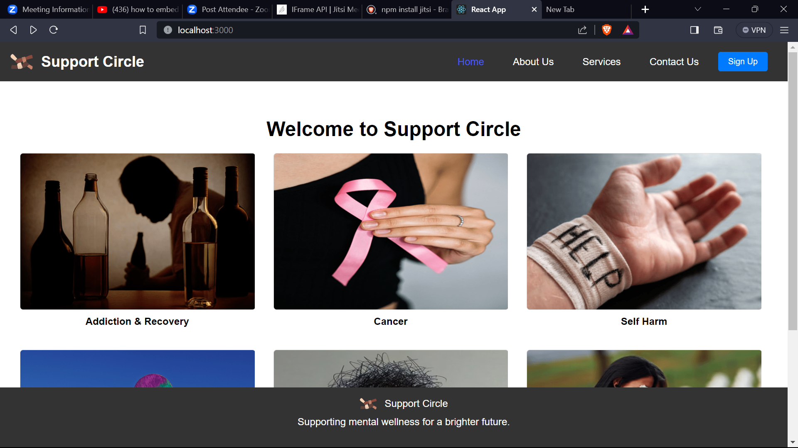
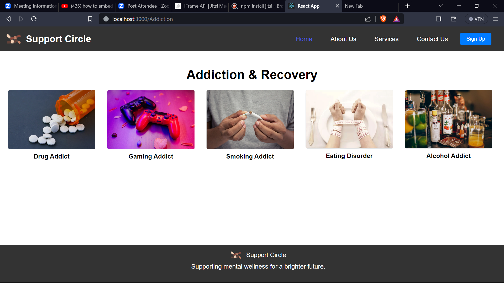
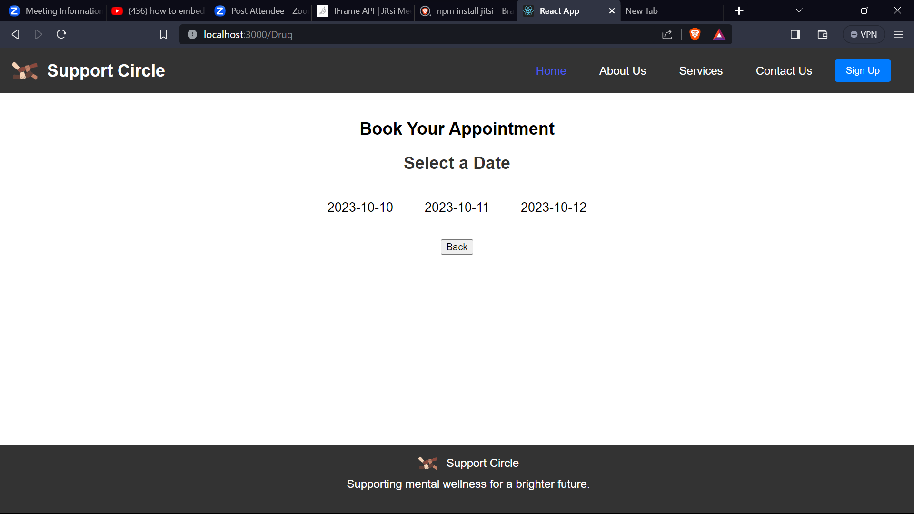
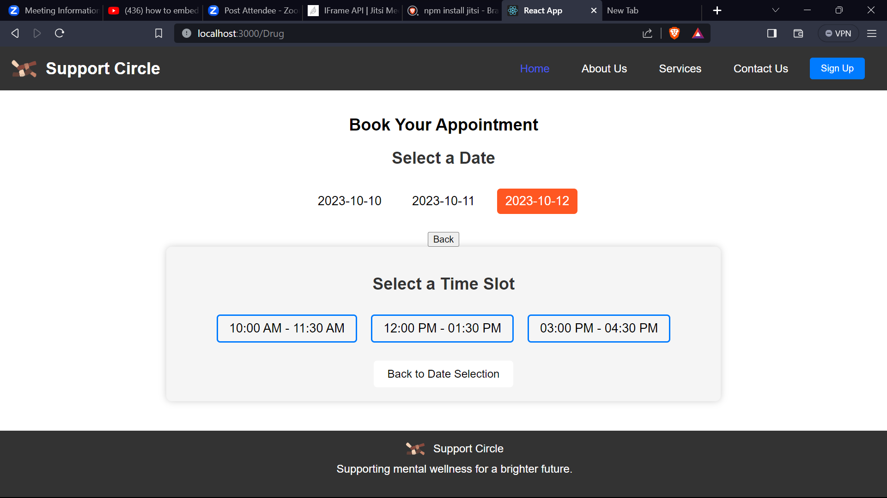
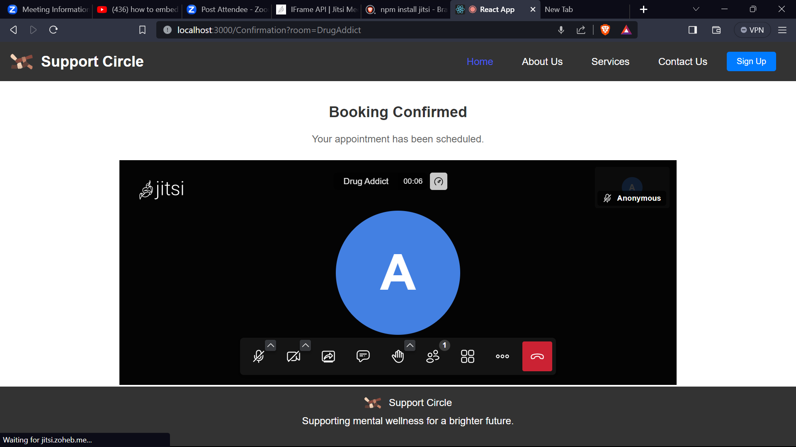

# Support Circle

"Support Circle is a online platform designed to provide support and resources for individuals dealing with addiction and recovery. Our website offers a user-friendly experience with a modern and responsive design. It features a variety of services, resources, and a booking system for therapy sessions. Built using React and Express.js with MongoDB for data storage, our platform prioritizes user engagement and easy navigation. Join our community on the path to recovery and support. Together, we can make a difference."

This project was bootstrapped with [Create React App](https://github.com/facebook/create-react-app).

## Available Scripts

In the project directory, you can run:

### `npm install`

it installs all the packages and dependencies present in the package.json file.

### `npm start`

Runs the app in the development mode.\
Open [http://localhost:3000](http://localhost:3000) to view it in your browser.

The page will reload when you make changes.\
You may also see any lint errors in the console.

## Libraries to install

In the project terminal, you can run:

### React Router 

React Router is used for handling routing in React applications.
It allows you to create single-page applications with different views or pages while maintaining a smooth user experience.

### `npm install react-router-dom`

### Jitsi

Jitsi is an open-source video conferencing platform that allows you to integrate video conferencing capabilities into your React application. 

### `npm install @jitsi/react-sdk`

## Website Demo

